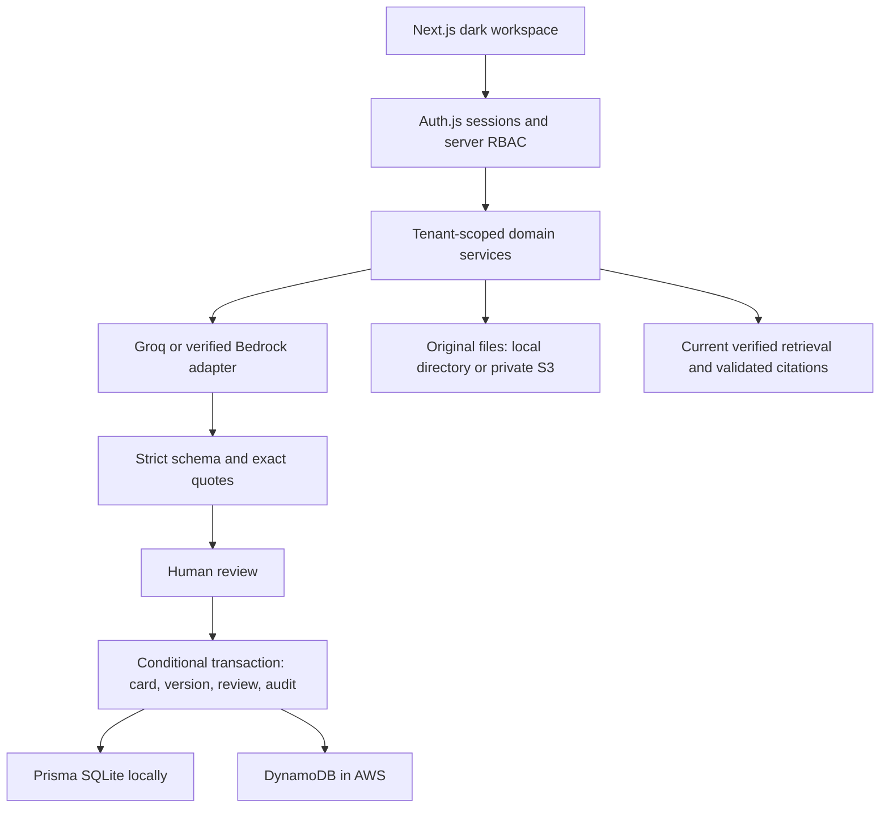

# Echo

Version control for organizational knowledge. New evidence is compared with current knowledge; a human reviews the proposal; the next verified version preserves every previous version.

**This delivery runs locally.** The current local configuration uses explicit demo rules and SQLite. It has not been deployed or security-certified. See [build status](docs/BUILD_STATUS.md) for implemented features and remaining work, and [security controls](docs/SECURITY.md) for evidence and limitations.

## Start locally

Use Node.js 22 (minimum 20.19).

```sh
npm ci
cp .env.example .env.local
```

Set `NEXTAUTH_SECRET` to a new random value and `ECHO_AI=demo` for a completely offline comparison rehearsal. Set `DATABASE_URL=file:./echo.db` in `.env` as well so the Prisma CLI can load it. This workspace already has local-only environment files initialized; do not overwrite them if you are continuing this delivery.

```sh
npm run db:setup
npm run dev -- --port 3001
```

Open <http://127.0.0.1:3001/signup>. Create an account and organization. In local development, `ECHO_LOCAL_MAIL=true` opens the verification page with a token; press **Verify email**, then sign in. This is a development helper, not proof of real email delivery. It is unavailable in production/AWS mode.

Choose **Load example workspace** on Overview. No shared default password or anonymous workspace bypass exists. The seed action never overwrites existing knowledge.

To load the example from the terminal after signup:

```sh
npm run seed -- owner@example.com
```

Local data lives in `prisma/echo.db` and `.echo-data/`. Both are ignored by Git. Originals, source documentation, and the previous Downloads application were preserved.

## Three-to-five minute demo

1. Overview → Load example workspace. Open Payment deployment and read the manual Service X restart procedure and incident-response fallback.
2. Add evidence → Use the Service X example → Compare evidence.
3. Review the `process_change` result and exact quotes. Demo rules are clearly labeled; no model call occurs in demo mode.
4. Verify the proposal, write a decision reason, and confirm update.
5. Check version 1 archived and version 2 current. Reviewer, source, reason and timestamps remain visible.
6. Ask Echo: “How should engineers handle Service X after a successful payment deployment?” The cited excerpt uses version 2 and shows its source and verification date.
7. Optionally restore version 1 as version 3; the previous two versions remain preserved.

## Live AI

`ECHO_AI=groq`, `GROQ_API_KEY`, and optional `GROQ_MODEL_ID` enable Groq; the default model is `openai/gpt-oss-20b`. Credentials remain on the server. Calls have bounded timeouts. Quotes must be exact source substrings; invalid output gets one constrained retry and then a typed error. Knowledge never changes on an AI failure.

Bedrock requires `ECHO_AI=bedrock`, `BEDROCK_MODEL_ID`, AWS credentials, and `BEDROCK_RUNTIME_VERIFIED=true`. Set the verification flag only after a successful runtime invocation in the target account/region. Listing models is insufficient.

Ask Echo intentionally quotes retrieved verified statements rather than generating unsupported paraphrases. Citation structure is validated in `lib/intelligence/citation.ts`. Source IDs/version metadata come from the server retrieval list.

## Validation

```sh
npm ci
npm run db:setup
npm run format:check
npm run typecheck
npm test
npm run check:infra
npm run eval
npm run build
npx playwright install --with-deps chromium
# Keep the local development server running on 3001, with local mail enabled.
npm run test:e2e
# Same flow over HTTP, when a browser or its system libraries are unavailable.
npm run smoke
npm run eval
```

Tests cover change detection itself (genuine change, rewording, contradiction, unrelated evidence, exact quoting), quote/citation validation, RBAC, tenant isolation, freshness, idempotency, real SQLite transactions, concurrent approvals, rollback, persisted review decisions, account invites and rate limits. Browser tests exercise signup through the current cited answer and capture desktop/mobile screenshots; `npm run smoke` drives the same path over HTTP when a browser is unavailable. AWS commands are validated by CDK synthesis and mocked adapter assertions, not live cloud requests.

`npm run eval` is a transparent rule-based smoke test across all eight relation labels. It prints each label and exits non-zero on any mislabelled case, because aggregate review precision and recall stay at 1.0 even when a real change is detected under the wrong label. `npm run eval -- --live` calls the configured model and measures classification accuracy and review precision/recall. The tiny dataset is not a production benchmark.

## Architecture



Production: Amplify/CloudFront → Next.js server → IAM-signed API Gateway → Lambda → tenant-scoped DynamoDB/S3. The Next.js server forwards an encrypted Auth.js session; Lambda verifies it and re-reads the user membership rather than trusting a tenant in the body. Cognito handles production identity and managed MFA/passkeys when configured. See [AWS deployment](docs/AWS_DEPLOYMENT.md).

## Code layout

```
app/                Next.js routes. app/api/[...path] authenticates, then delegates to lib/service.
lib/service/        The knowledge API, one module per resource, behind a single route table.
  index.ts            dispatch() — route table shared by the Next.js route and the Lambda handler
  knowledge.ts        create a card, seed the example, roll back to an earlier version
  evidence.ts         ingest a document, download the original, compare it to a card
  reviews.ts          the human decision, and assignment / snooze / evidence requests
  workspace.ts        tenant snapshot, manual freshness sweep, Ask Echo
  organization.ts     invitations, roles, organization settings
  shared.ts           ApiResult, RouteContext, the comparison idempotency key
lib/intelligence.ts Relation rules and passage extraction; lib/ai/* is the live model contract.
lib/repository.ts   Tenant-scoped reads and the conditional transaction every knowledge write uses.
lib/db/store.ts     One row shape over SQLite (local) and DynamoDB (AWS).
lib/auth/           Sessions, RBAC matrix, password hashing, origin checks, rate limits.
backend/handler.ts  The same dispatch() behind API Gateway.
infra/              CDK stack, synthesised and asserted in tests; never deployed here.
```

Run `npm run format` before committing; CI runs `npm run format:check`.

## Roles

| Role     | Read | Submit evidence | Create verified card | Decide / rollback | Audit | Admin |
| -------- | ---- | --------------- | -------------------- | ----------------- | ----- | ----- |
| Owner    | yes  | yes             | yes                  | yes               | yes   | yes   |
| Admin    | yes  | yes             | yes                  | yes               | yes   | yes   |
| Reviewer | yes  | yes             | yes                  | yes               | no    | no    |
| Editor   | yes  | yes             | no                   | no                | no    | no    |
| Viewer   | yes  | no              | no                   | no                | no    | no    |
| Auditor  | yes  | no              | no                   | no                | yes   | no    |

Editors can submit evidence but cannot declare it canonical. Role changes revoke existing sessions. Invitations are short-lived, email-bound links; they are not emailed automatically.

## Important boundaries

- AI proposes; humans verify. No guarantee of organizational truth.
- Local demo rules are lexical, not semantic AI. They cover rewording, contradiction (reversed conditions and changed figures), schedule changes, version deprecation, hosting migration and manual-to-automated process changes. Anything they cannot resolve becomes `adds_context` for a human, never a silent pass. Integration tiles are marked planned.
- Evidence is deduplicated per organization/card pair; the same source can be compared to different cards.
- Review transactions fail on concurrent writes and preserve the previous state. Refresh and retry; no silent overwrite.
- Tenant-wide optimistic revision guards prioritize correctness over write throughput. Production-scale pagination and contention testing remain work.
- Freshness is rule-based and manually triggered. Validity windows can be supplied through the knowledge API; the form currently exposes review frequency.
- S3 and database resource configuration is defined but not deployed. Do not describe production controls as verified until the deployment checklist is completed.

## Decisions and roadmap

See [ADRs](docs/adr/README.md), [claims we avoid](docs/CLAIMS_WE_AVOID.md), [build status](docs/BUILD_STATUS.md), and `lib/integrations/contracts.ts` / `lib/roadmap/contracts.ts` for explicitly unimplemented extension contracts.
